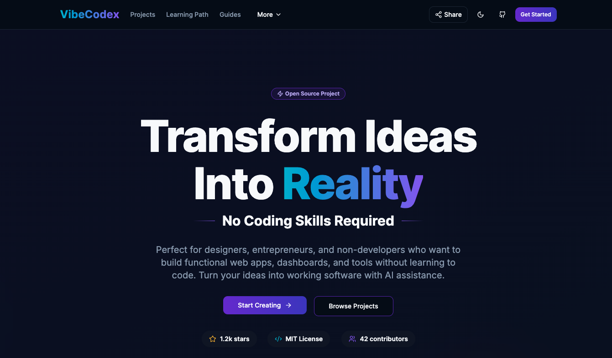

# VibeCodex - AI Coding Starter Kit

[](https://opensource.org/licenses/MIT)
[](https://nextjs.org/)
[](https://www.typescriptlang.org/)
[](https://tailwindcss.com/)
[](CONTRIBUTING.md)



> **Transform your ideas into applications with AI-powered development**

VibeCodex is a comprehensive starter kit that bridges the gap between AI-generated code and production-ready applications. Whether you're prototyping with v0.dev, building with Bolt.new, or developing with Lovable, this kit provides the structure, prompts, and workflows you need to ship faster.

## 🚀 Quick Start

### Option 1: Use the Template (Recommended)

1. **Click "Use this template"** on GitHub to create your own repository.

2. **Clone your new repository**:
```bash
git clone https://github.com/YOUR_USERNAME/YOUR_REPO_NAME.git
cd YOUR_REPO_NAME
```

3. **Install dependencies**:
```bash
npm install
```

4. **Start developing**:
```bash
npm run dev
```

### Option 2: Fork and Contribute

1. **Fork this repository** to contribute back to the community.
2. **Clone your fork**:
```bash
git clone https://github.com/YOUR_USERNAME/v0-vibecodex.git
cd v0-vibecodex
```

3. **Follow the same installation steps** as above.

## 🎯 What's Inside

### 🏗️ Project Templates
- **Kanban Board**: Team collaboration with drag-and-drop
- **Personal Dashboard**: Habit tracking and goal management
- **Landing Page**: Product showcase with email capture
- **CMS System**: Content management with rich editor
- **Expense Tracker**: Personal finance management
- **Recipe Finder**: Search and discovery interface

### 📚 Comprehensive Guides
- **AI Development Workflow**: From idea to deployment
- **From v0 to Cursor**: Transition from prototype to local IDE
- **GitHub Integration**: Version control and collaboration
- **Requirements Planning**: Structure your project scope
- **Tool Integration**: Connect AI tools to your workflow

### 🛠️ AI Tool Integration
- **v0.dev**: React component generation
- **Bolt.new**: Full-stack development environment
- **Lovable**: AI-assisted application building
- **Replit**: Collaborative coding platform

## 🎨 Features

- ✅ **12 Production-Ready Project Templates**
- ✅ **Structured AI Prompts** for consistent results
- ✅ **Multi-Tool Support** (v0, Bolt, Lovable, Replit)
- ✅ **Phase-Based Development** approach
- ✅ **Responsive Design** with Tailwind CSS
- ✅ **Dark/Light Mode** support
- ✅ **SEO Optimized** with Next.js 14
- ✅ **TypeScript** for type safety
- ✅ **Component Library** with shadcn/ui

## 📖 Documentation

### Getting Started
- [Project Overview](https://github.com/jalcantarab/v0-vibecodex#readme)
- [Installation Guide](https://github.com/jalcantarab/v0-vibecodex#quick-start)

### Development Guides
- [AI Development Workflow](https://vibecodex.dev/guides/ai-development)
- [Requirements Template](https://vibecodex.dev/guides/requirements-template)
- [From v0 to Cursor](https://vibecodex.dev/guides/from-v0-to-cursor)
- [GitHub Basics Guide](https://vibecodex.dev/guides/github-basics)
- [Tool Integration Guide](https://vibecodex.dev/guides/ai-development/tools)

### Project Templates
- [Browse All Projects](https://vibecodex.dev/projects)
- [Kanban Board Tutorial](https://vibecodex.dev/projects/kanban-board)
- [Personal Dashboard Guide](https://vibecodex.dev/projects/personal-dashboard)

## 🤝 Contributing

We welcome contributions! Here's how you can help:

1. **Star this repository** if you find it useful.
2. **Share your projects** built with VibeCodex.
3. **Submit new project templates** via pull request.
4. **Improve documentation** and guides.
5. **Report bugs** or suggest features.

See our [Contributing Guide](CONTRIBUTING.md) for detailed instructions.

## 🏆 Community

### Connect
- **GitHub**: [jalcantarab/v0-vibecodex](https://github.com/jalcantarab/v0-vibecodex)
- **Email**: [contact@zentrik.ai](mailto:contact@zentrik.ai)
- **Website**: [VibeCodex](https://vibecodex.dev)
- **Website**: [Zentrik](https://zentrik.ai)
- **LinkedIn**: [Zentrik](https://www.linkedin.com/company/zentrik-ai)

## 📋 Roadmap

### ✅ Completed
- [x] Core project templates and structure
- [x] AI tool integration guides
- [x] Responsive design system
- [x] GitHub workflow documentation
- [x] SEO optimization and metadata
- [x] Legal pages and compliance

### 🚧 In Progress
- [ ] Advanced project templates
- [ ] Tutorials and walkthroughs
- [ ] API integrations guide

### ✅ Recently Completed
- [x] Prompt, Instructions and Cursor Rules Templates

### 🔮 Planned
- [ ] App companion
- [ ] Advanced AI prompt library
- [ ] Team collaboration features
- [ ] Enterprise deployment guides

## 📄 License

This project is licensed under the MIT License - see the [LICENSE](LICENSE) file for details.

## 🙏 Acknowledgments

- **Vercel** for Next.js and v0.dev
- **StackBlitz** for Bolt.new
- **Lovable** for AI development tools
- **Replit** for collaborative coding
- **shadcn** for the component library
- **Tailwind CSS** for the styling system

## 📞 Support

Need help? We're here for you:

- **Documentation**: Check our [guides](https://vibecodex.dev/guides) first.
- **Issues**: [GitHub Issues](https://github.com/jalcantarab/v0-vibecodex/issues)
- **Email**: [contact@zentrik.ai](mailto:contact@zentrik.ai)
- **Community**: Join our discussions.

---

**Built with ❤️ by [Jorge Alcantara](https://www.linkedin.com/in/jorgeakairos/) and the VibeCodex community using v0.dev, cursor.com and [Zentrik](https://zentrik.ai)**

*Transform your ideas into applications with AI-powered development*
